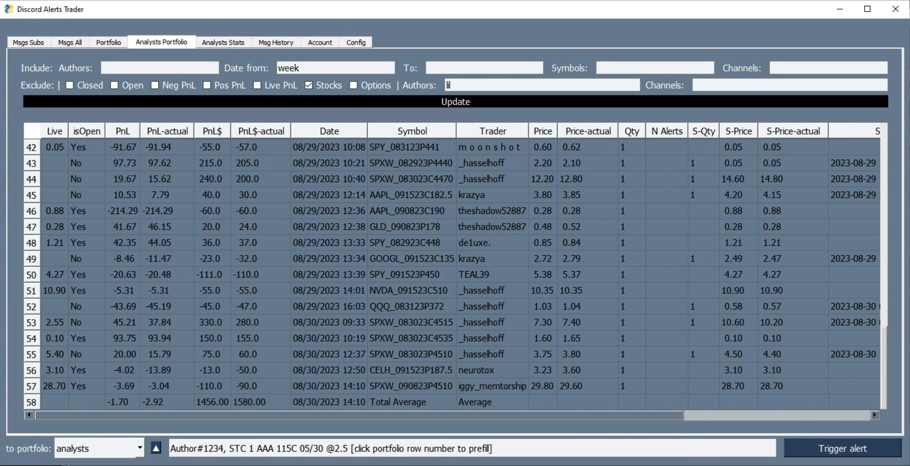
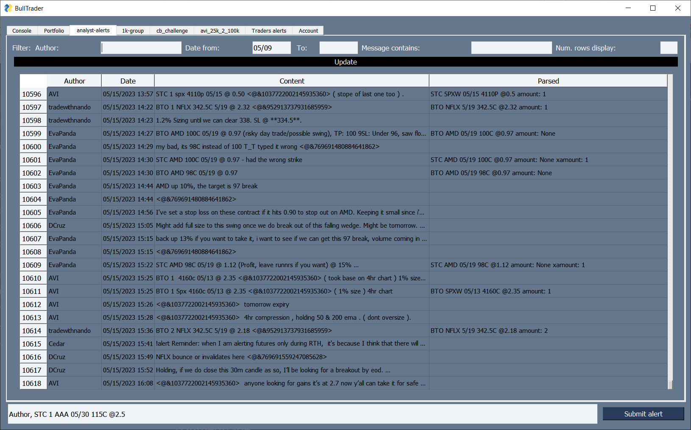
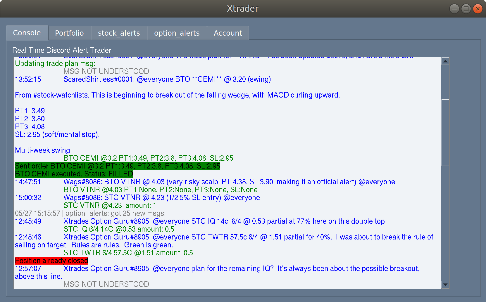
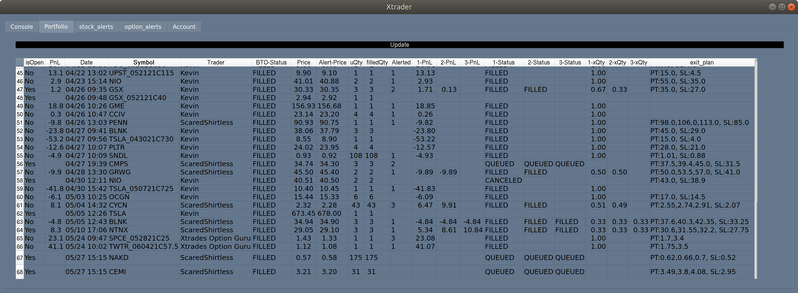

# DiscordAlertsTrader: *Discord Alerts Trader Bot*
________________________


[](https://discord.gg/9ejghcjpar "realtime support / chat with the community and the team.")

 If you like this package, give it a star!


A Python package to automate trades from alerts shared in a Discord channel by analysts.
The package parses these messages and executes trades from traders specified in the configuration file. 
It tracks messages from all the channels, generates a portfolio from analysts and from trades executed, 
provides live quotes to see actual alert profits (rather than prices stated in the alert), and can trigger
an alert to open long or short a position, close it or update exits (target profit, stop loss).

Trades are done through APIs of TDAmeritrade (full functionality), eTrade (either a PT or SL order) or webull (either a PT or SL order, not trailing stops).
If no brokerage API key is provided, it will just print the discord messages and track the 
analysts' portfolio. With an API key, it will track the current price of the alerts, besides executing trades.

If in `config.ini`, `DO_BTO_TRADES = false`, no trades will be executed. 


## GUI capabilities ##

- Parsing trading signals from messages (e.g., BTO, STC, SL, PT).
- Tracking trading signals with a message history tab for the channel
- Tracking performance with real-time actual prices and returns.
- Opening, closing, and updating trades through the GUI.
- Calculate analysts' stats and provide options to test stats with maximum capital 
- Checking order and account status, and accessing current ticker prices.
- Supporting manual trade execution through prompts if `auto_trade` is set to False in `config.ini` (not maintained).


**Current Discord servers being used**:
- **EnhancedMarket** TradeProElite (profitable strategies about 10-8k month [fully pays $100 membership], uses software to quickly send trade alerts for minimal delay even for scalpings and uses a bot to track trades alerted PnL and market price PnL, full transparency. Good for learning how to trade with live sessions): invite links with 5 day trials: [Gold](https://whop.com/tradeproelite/?d2c=true&directPlanId=plan_j1IIQmDRiu63q&pass=prod_rJqBNfMDOprhs&a=transverseblouse3c34) or [VIP (with live trading)](https://whop.com/tradeproelite/?d2c=true&directPlanId=plan_dz8MNZD1bO6Vi&pass=prod_KtXKwzfXMW7ck&a=transverseblouse3c34)
- **Xtrades** (alerts with market price data tracked with a bot, their stats posted on their web match what you can get, multiple analysts, see historical trades in the GUI Analysts tabs [$38 membership]): [invite link](https://app.xtrades.net/invite/4lk91GuPz0KsoJWYP74ieg)
- **BullTrades** (good for shorting [bad trades, delayed alerts, they show alerted PnL but hide market priced PnL], see historical trades in this repo data/analyst_portfolio_bulltrades.csv(5/10 to 8/7) and [stats screenshot image](media/bulltrades_stats_05_08.png)): [invite link](https://bulltrades.net/?ref=ndrjogi)

Supports any Discord channel with structured BTP/STC alerts as message contents (server_formatting.py has functions to change different server formattings, including embedded messages)


Let me know if you find the package useful or need support by dropping me a DM or visiting the [discord server](https://discord.gg/9ejghcjpar)

 ________________________


(older version shots)




 ## Discord user token and channel IDs
 ______________________________

It requires a user discord token, once installed the package saves the token in config.ini[discord], as well as the channel ID where alerts are posted.
To get the discord token follow the instructions: https://www.androidauthority.com/get-discord-token-3149920/
To get the channel ID, in Discord right click on the channel and click "Copy Channel ID"

**Automation of user accounts is against Discord ToS. This package only reads alerts and Discord can not detect automation behavior,
however, if you want to follow Discords ToS, do not provide a user token and manually input the alerts at the bottom of the GUI to
manually trigger the alerts ;)**

## Installation and Setup
 ______________________________

1. Install Python 3.10:
   - For Windows, open PowerShell and run the following command, verify that it prints out "Hello World!":
     ```powershell
     if (-not (Test-Path $env:USERPROFILE\scoop)) {
         # Install Scoop
         Set-ExecutionPolicy RemoteSigned -Scope CurrentUser
         irm get.scoop.sh | iex
     }
     scoop install git
     # Check if extras are included
     $extras = scoop bucket list | Select-String -Pattern '^extras$'
     if (-not $extras) {
         # Add the extras bucket    
         scoop bucket add extras
     }
     # Install Miniconda3
     scoop install miniconda3
     # Check python is installed
     python -c "print('Hello, World!')"

     # Make sure is python 3.10
     conda install python=3.10
     ```
    - For macOS:
     - Install Miniconda by selecting your OS version: https://docs.conda.io/en/latest/miniconda.html
     - Open the terminal (cmd + space -> terminal) and type conda install python=3.10, then follow the next steps inside the terminal
      
2. In the PowerShell terminal navigate to the directory where you want to clone the DiscordAlertsTrader package, e.g. type: `cd Desktop`.

3. Clone the package from the GitHub repository and install the package and its dependencies using pip:
   ```shell
   git clone https://github.com/AdoNunes/DiscordAlertsTrader.git
   cd DiscordAlertsTrader
   pip install -e .
   ```

5. Copy the example configuration file to `config.ini`:
   ```shell
   cp DiscordAlertsTrader/config_example.ini DiscordAlertsTrader/config.ini
   ```

6. Edit the `DiscordAlertsTrader/config.ini` file to add your Discord token and configure other settings:
   - Add your Discord token in the appropriate field.
   - (Optional) Modify other configurations as needed, such as authors to follow, trailing stop, etc.
   - (Optional) If you have a TDA/etrade API, add it to the configuration. See next sections.

**Running the DiscordAlertsTrader**

To run the DiscordAlertsTrader, execute the following command in the terminal:

```shell
DiscordAlertsTrader
```

This will launch the DiscordAlertsTrader application and start listening for alerts on Discord.

Make sure to keep the terminal or command prompt window open while the application is running to see any output or errors.

**Closing the Application**

To stop the DiscordAlertsTrader application, simply close the terminal or command prompt window where it is running.

## Etrade API
____________

Create a sandbox (mock) api key:
https://us.etrade.com/etx/ris/apikey

To get the production (real) keys, fill out the forms at the bottom of:
https://developer.etrade.com/getting-started

Make sure to select free real-time quote data:
https://us.etrade.com/etx/hw/subscriptioncenter#/subscription

Before running the package and send orders, in etrade web make a trailing stop order and preview to sign an Advanced Order Disclosure, otherwise an error will arise when posting the order

Etrade does not have One Cancels the Other (OCO) so you can not pass a target profit and stoploss at the same time. However, the package can create a local OCO, by passing in the alert or config default exits, a PT1 50%TS5% SL 50% (numbers can change). This will create an SL order, and every 10 secs check the contract price until it reaches 50%, then it will create a trailing stop of 5%.

## Webull API
____________

You will need to get a device ID, follow these steps to get DID, and then save it in the config.ini, along with credential details: 
[https://github.com/tedchou12/webull/wiki/Workaround-for-Login-Method-2](https://github.com/tedchou12/webull/wiki/Workaround-for-Login-%E2%80%90-Method-2)

Trading pin is the 6 digit code used to unlock webull

Webull does not have One Cancels the Other (OCO) so you can not pass a target profit and stoploss at the same time. Also there is no trailing stop.
However, the package can create a local OCO, by passing in the alert or config default exits, a PT1 50%TS20% SL 50% (numbers can change). This will 
create an SL order, and every 10 secs check the contract price until it reaches 50%, then will try to create a trailing stop of 20%, but because of webull 
it will instead sell at PT.

## TDAmeritrade
_______________

*CURRENTLY NO NEW DEVELOPER ACCOUNT ARE CREATED UNTIL THE MERGE*

To access the TDAmeritrade account for trading and info is necessary to install 
td-ameritrade-python-api from:

```pip install td-ameritrade-python-api```

Follow the instructions from the github repository to set up an API developer account and get a 
token:
https://github.com/areed1192/td-ameritrade-python-api

once you have your TDA client id, edit config.ini TDA section. There needs to be:

```
[TDA]
client_id = QBGUFGH...
redirect_url = https://127.0.0.1/
credentials_path = secrets_td.json
```

then, run the script:
```python setup_TDA.py```
it will prompt to:

```
$Go to URL provided authorize your account: https://auth.tdameritrade.com/auth?response_type=code&redirect_uri=.......OAUTHAP
$ Paste the full URL redirect here:
```

In your browser go to the link, accept TD ameritrade pop-up and copy the link you get re-directed. Once entered you will have your secrets_td.json

## Disclaimer
_________

This is still a Work in Progress project. I get good results using the package, If you plan to use it, **USE AT YOUR OWN RISK**. 

The code and package provided in this repository is provided "as is" and without warranty of any kind, express or implied, including but not limited to the warranties of merchantability, fitness for a particular purpose, and noninfringement. In no event shall the author or contributors be liable for any claim, damages, or other liability, whether in an action of contract, tort, or otherwise, arising from, out of, or in connection with the code or package or the use or other dealings in the code or package.

Please use this code and package at your own risk. The author and contributors disclaim all liability and responsibility for any errors or issues that may arise from its use. It is your responsibility to test and validate the code and package for your particular use case.

